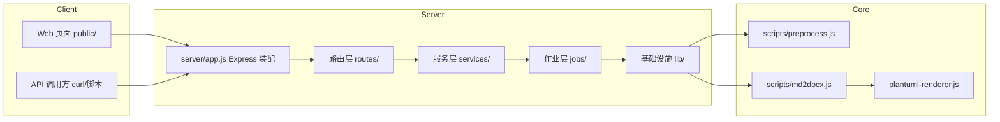

# md2docx HTTP 服务架构说明

本文档描述 md2docx HTTP 服务（REST API + Web 上传页面）的架构设计、运行方式与实现细节。配套文档见 [API 参考](./api.md)。

## 1. 概览

md2docx 原本是纯 CLI（`preprocess.js` → `md2docx.js` 两阶段流水线）。HTTP 服务在**不改动转换能力**的前提下，为它增加一个 Web 层：用户上传 `.md` 文件，服务异步转换，轮询进度，下载 `.docx`。

**核心原则：服务端复用现有 scripts 核心，不另起炉灶。** 服务端走 `preprocess`（全量渲染图表）→ `convert`（仅处理图片引用）的固定管线，与 `md2docx.sh` 完全一致，从根本上消除"双路渲染差异"。

## 2. 技术栈与依赖

| 组件 | 版本 | 用途 |
|---|---|---|
| Node.js | v24（Docker 用 node:22 LTS，代码避开 24-only API） | 运行时 |
| Express | ^4.22.2 | Web 框架 |
| Multer | 1.4.4-lts.1（安全修复版） | multipart 上传 |
| worker_threads | Node 内置 | 作业执行线程隔离 |
| 既有核心 | preprocess.js / md2docx.js / plantuml-renderer.js | 转换逻辑（复用） |

新增依赖合计约 6 MB，对比既有 `node_modules`（465 MB）可忽略。

## 3. 总体架构



### 3.1 分层职责

| 层 | 目录 | 职责 |
|---|---|---|
| 路由层 | `server/routes/` | HTTP 解析 / 校验 / 响应，不含业务逻辑 |
| 服务层 | `server/services/` | 转换编排、依赖探测、请求防护 |
| 作业层 | `server/jobs/` | 队列、状态存储、worker 线程、作业生命周期 |
| 基础设施 | `server/lib/` | 管线辅助、日志、配置、限流 |
| 核心 | `scripts/` | 纯转换逻辑（与 CLI 共享） |
| 前端 | `server/public/` | 静态页面（零构建，原生 HTML/JS/CSS） |

## 4. 核心设计决策

### 4.1 异步作业模型

一次转换含多次图表渲染（Chrome/Java），耗时 5~60 秒。采用**提交 → 轮询**模型：

```text
POST /api/convert        → 202 { jobId }        （只存文件、建作业，立即返回）
GET  /api/jobs/:id       → { status, progress }  （轮询进度）
GET  /api/jobs/:id/download → 下载产物（须 status=done，否则 409）
```

**状态机**：`queued → running → done | failed`

### 4.2 worker_threads 隔离（P0 硬约束）

底层渲染调用（mmdc / plantuml / python3）全部是 `execSync`。若直接在主进程跑，单次渲染会冻结整个事件循环——进度条卡死、健康检查无响应。因此：

- **每个作业 spawn 一个 Worker 线程**运行 `job-worker.js`（内部 `execSync` 天然被隔离）
- 主线程只做 HTTP 与状态管理，**永不阻塞**
- `maxConcurrent`（默认 2）即 worker 并发上限，超出排队

### 4.3 作业隔离

- 每作业独立工作目录 `data/jobs/<jobId>/`（upload.md / clean/ / .mermaid/ / .plantuml/ / docx/）
- `preprocess` 的缓存目录通过 `opts` 参数化传入，**同名文件并发提交互不覆盖**
- 图片引用路径白名单：只允许作业目录内相对路径，禁止绝对路径与 `..` 越界（防路径穿越）
- 启动时清扫孤儿目录；`SIGTERM`/`SIGINT` 优雅关闭（等待 running 完成，30 s 超时）

### 4.4 请求防护

- 扩展名校验（仅 `.md`）、文件大小上限（20 MB）、YAML 上限（64 KB）
- **图表数量上限**（默认 30 块）——防止小文件塞大量图表打满队列
- IP 速率限制（每分钟 N 次提交）、队列长度上限（超出 429）

### 4.5 依赖探测缓存

`/api/health` 的依赖探测（含 `execSync('dot -V')`）**只在缓存过期时执行**（TTL 60 s），不进入高频请求路径。

## 5. 目录结构

```text
server/
  app.js                  Express 装配（中间件、路由、错误处理、优雅关闭）
  config.js               配置（端口/并发/上限/TTL，环境变量可覆盖）
  routes/
    health.js             健康检查
    convert.js            上传转换
    jobs.js               作业查询/下载/删除
  services/
    conversion-service.js 转换编排：校验→建作业→入队→归档
    dependency-check.js   依赖探测 + 缓存
  jobs/
    job.js                作业模型
    job-store.js          内存存储 + TTL/孤儿清理 + 一致性校验
    job-queue.js          并发受限队列 + 优雅关闭
    job-worker.js         worker 线程：跑 preprocess + convert
  lib/
    pipeline.js           管线辅助（图表计数/路径白名单/日志脱敏/目录构建）
    logger.js             日志
    rate-limit.js         滑动窗口 IP 限流
  public/
    index.html            上传页面
    app.js                前端逻辑
    style.css             样式
data/jobs/                作业工作目录（gitignore，运行时生成）
```

## 6. 关键实现细节

### 6.1 进度口径

- preprocess 占整体进度 **0~60%**（内部按图数加权）
- convert 占整体进度 **60~100%**

`job-worker.js` 通过 `onProgress` 回调把核心管线进度映射到整体 0~100，前端据此渲染进度条。

### 6.2 双路一致性（评审 M1）

服务端管线**固定为 preprocess（全量渲染）→ convert（仅图片引用）**。`md2docx.js` 的 fence 自渲染在服务端是死路径。一个已知的既有差异不是 bug：preprocess 注入 mermaid `neutral` 主题 + linear 曲线，md2docx 兜底渲染只注入 linear（服务端不触发），**不要"修复"对齐**。

### 6.3 覆盖语义（评审 M8）

`POST /api/convert` 的 `title`/`company`/`date` 表单参数**优先于 YAML front matter**（真覆盖）。`preprocess` 在生成 clean.md 前改写 YAML。

### 6.4 错误模型

```json
{ "error": { "code": "CONVERSION_FAILED", "message": "..." } }
```

- 校验类错误返回 4xx（400/409/413/429）
- **转换失败 ≠ 作业失败**：图表渲染失败降级为代码块（既有设计），作业仍 `done` 但带 `warnings`
- 返回前端的日志做脱敏（去掉 `data/jobs/<id>/` 绝对路径前缀）

## 7. 运行方式

```bash
# 开发运行
node server/app.js
# 或带环境变量
PORT=8080 MAX_CONCURRENT=2 node server/app.js

# 环境变量（均可选，见 config.js）
PORT            # 默认 8080
HOST            # 默认 0.0.0.0
DATA_DIR        # 默认 ./data（作业目录）
MAX_CONCURRENT  # 默认 2
MAX_FILE_SIZE_MB# 默认 20
MAX_DIAGRAMS    # 默认 30
JOB_TTL_MINUTES # 默认 60
RATE_LIMIT_PER_MINUTE # 默认 20
DEBUG           # 1 开启调试日志
```

## 8. 测试

| 类别 | 覆盖点 | 方法 |
|---|---|---|
| 单元 | job-store 状态流转、job-queue 并发上限、pipeline 白名单/计数 | Node 内联测试 |
| 集成 | 上传→轮询→下载→python-docx 校验 | curl 全流程 |
| 并发 | 5 作业并发、2 个同名文件同时提交（验证缓存隔离） | curl 批量 |
| 安全 | 越界图片引用、非 .md、超大文件、超图表数 | curl 错误路径 |
| 前端 | 上传→进度→完成→下载 | Playwright (CDP) |
| 回归 | CLI 重构后 golden 比对 | `md2docx.sh` |

## 9. 与 CLI 的关系

HTTP 服务**不改动 CLI 行为**：

- `scripts/preprocess.js` / `scripts/md2docx.js` 重构为可编程 API（导出 `preprocess`/`convert` 函数），同时保留 CLI 入口（`if (require.main === module)`）
- CLI 默认路径逻辑不变（`inputDir/output/...`）
- 重构后已跑 `md2docx.sh` 端到端回归确认行为一致
