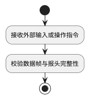

# 003 — 旧式活动图（裸写活动名）渲染失败

| 项目 | 值 |
|---|---|
| 状态 | fixed（待端到端复核） |
| 严重度 | 中（单篇文档可致 31% 的图降级为代码块） |
| 发现日期 | 2026-09-17 |
| 记录时 commit | `0edb265`（修复前） |
| 修复位置 | `scripts/plantuml-renderer.js`：新增 `fixBareActivityNames()`，接入 `renderPlantUML()` 的失败补救链 |
| 触发案例 | `GMS-JD-SRS-V1.0.md`（1.4 MB，258 个 PlantUML 块，81 个失败） |

## 1. 现象

含活动图（activity diagram）的文档，活动名**裸写一行**时渲染必然失败，整块降级为
` ```text ` 代码块，成品文档里该处显示为一段源码而非流程图。

触发案例中 258 个 PlantUML 块有 **81 个失败（31.4%）**，且全部是活动图。

## 2. 最小复现

```plantuml
@startuml
start
接收外部输入或操作指令
校验数据帧与报头完整性
stop
@enduml
```

实测（core 与 jar 两个后端**均**失败，已排除"后端过严"）：

```text
❌ PlantUML 渲染失败（第 3 行）
  错误位置: 接收外部输入或操作指令
  原始错误: Error line 5 in file: Syntax Error? (Assumed diagram type: activity)
```

## 3. 根因

新版 PlantUML 要求活动名用 `:名称;` 包裹：



裸写活动名在新旧语法下**都不合法**：

- 新语法（activity-diagram-beta）要求 `:活动名;`
- 官方 legacy 语法用的是 `(*)` 起点 + **带引号**的名称（如 `"First Action"`），同样不支持裸写

即：这是**源文件写法过时/错误**，不是 md2docx 的解析缺陷。

参考：

- [Activity Diagram (legacy)](http://alphadoc.plantuml.com/raw/dokuwiki/en/activity-diagram-legacy)
- [Activity Diagram (new Syntax)](https://plantuml.com/activity-diagram-beta)
- 官方论坛对同类报错与 `:a;` 写法的说明：[Parsing Error (Assumed diagram type: sequence)](https://forum.plantuml.net/20099/parsing-assumed-diagram-sequence-activity-diagram-version)

## 4. 修复（已实施）

在 `scripts/plantuml-renderer.js` 新增 `fixBareActivityNames()`，并作为**第三种**
自动修复候选接入 `renderPlantUML()` 的失败补救链（与既有的 `fixMultiElse`、
`fixUnquotedNames` 并列）：

```javascript
const candidates = [
  { label: '多 else 语法', code: fixMultiElse(baseCode) },
  { label: '名称加引号',   code: fixUnquotedNames(baseCode) },
  { label: '旧式活动图裸写活动名', code: fixBareActivityNames(baseCode) },
];
```

### 4.1 改写规则

逐行判断，仅把"看起来是裸写活动名"的行改写为 `:名称;`：

- 跳过空行、关键字/指令行（`start`/`stop`/`if`/`else`/`endif`/`@…`/`!theme`/`skinparam`/`note` 等）
- 跳过箭头行（含 `->`、`..>`、`==`）
- 跳过已合规行（`:` 开头）、泳道定义（`|` 开头）
- 跳过含 ASCII 特殊字符的行（`:";{}[]<>=@#$%^&*~\`\\` 等）——不冒险
- 仅接受以中文、字母或数字开头的行

### 4.2 为什么是安全的

1. **只在渲染失败后补救**，成功才采用——与既有两个 fix 同一机制，
   因此**不可能影响本来就能正常渲染的图**。
2. **有活动图特征才介入**：仅当块内出现 `start` / `stop` / `if(` / `while(` / `repeat`
   时才尝试，避免误伤用例图、类图里合法的裸标识符。
3. 失败修复链按顺序尝试，前两个（多 else、加引号）先跑，本修复排在最后。

## 5. 验证

触发案例 `GMS-JD-SRS-V1.0.md`（258 块）：

| 指标 | 修复前 | 修复后 |
|---|---|---|
| PlantUML 渲染成功 | 177 / 258 | **258 / 258** |
| 失败 | 81 | **0** |

**精确安全性验证**（关键在于只碰该碰的块）：

```text
总块数: 258  原失败块: 81
修复函数改写的：原失败块 81 / 81
              原正常块 0（应为 0，非 0 即误伤）
  ✅ 未触碰任何原本正常的图
```

**渲染产物语义校验**：仅"渲染成功"不足以说明改写正确（改写的是图的源码），
已用 vision-engine 对产出 PNG 逐节点核对——起点、两个处理节点、`数据有效?`
判断分支及 `是`/`否` 标签、两个终点均完整，无残缺/重叠/文字截断，流程走向与
源码语义一致。

## 6. 关联

- 同类"渲染失败 → 自动修复"机制见 `AGENTS.md` 已知陷阱第 9 条（名称加引号）。
- 该文档的表格问题另见 [004](004-missing-table-separator-row.md)（同一份文档、
  同一批批量生成产物，但根因不同）。
