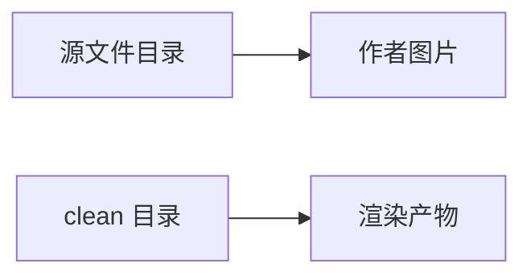

# 作者自带本地图片回归

本用例覆盖缺陷 002：作者在 markdown 里引用**自己旁边的图片文件**时，
完整流水线（preprocess → convert）必须正常嵌入，而不是降级为占位文字。

判定要点：md 与其图片资产位于同一目录（`assets/` 子目录），
经 `scripts/md2docx.sh` / `scripts/cli.js` 转换后，成品 DOCX 内
`<w:drawing>` 数量必须等于下文图片引用数（2 张）。

## 图片引用

**图 1-1 本地架构图**

正文穿插在两张图之间，用于确认图片顺序与题注位置。

**图 1-2 第二张本地图片**

## 与渲染图表共存

下面这张是 preprocess 渲染出来的 mermaid 图（引用位于 `output/.mermaid/`），
用于确认"作者自带图片"与"渲染产物图片"两类引用**可以共存**，
即两种解析基准都生效。

**图 1-3 两类图片来源共存**
