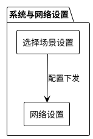
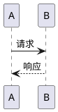

# PlantUML 缺结束标记回归

验证「只有 `@startuml` 没有 `@enduml`」时能否自动补全并渲染。

## 缺 @enduml 的组件图

```plantuml
@startuml
!theme plain
skinparam componentStyle rectangle

package "系统与网络设置" {
  component "选择场景设置" as cjxz
  component "网络设置" as wlsz
}

cjxz --> wlsz : 配置下发
```

## 正常的时序图（回归）

```plantuml
@startuml
A -> B: 请求
B --> A: 响应
@enduml
```
