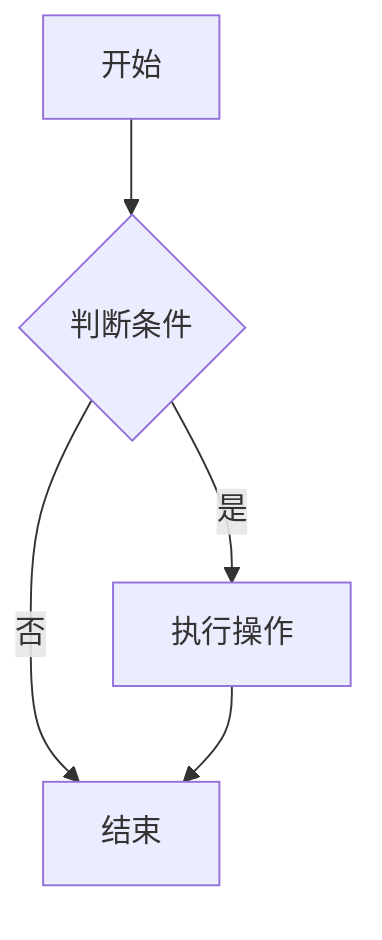
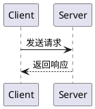

# md2docx 综合功能测试

本文档用于端到端验证 md2docx 及 HTTP 服务的全部核心功能，包括标题层级、列表、表格、题注、Mermaid 与 PlantUML 图表。

## 标题与段落

### 三级标题

#### 四级标题

##### 五级标题

正文段落示例：本段验证正文样式——仿宋小四、首行缩进两字符、1.5 倍行距。包含中文与西文混排，如 RESTful API、HTTP/2、TLS 1.3，西文应使用 Times New Roman。

## 列表

- 一级列表第一项
  - 二级列表第一项
    - 三级列表第一项
    - 三级列表第二项
  - 二级列表第二项
- 一级列表第二项
- 一级列表第三项

## 表格

| 序号 | 功能项 | 说明 | 状态 |
|---|---|---|---|
| 1 | 标题编号 | Word 自动多级编号 | 通过 |
| 2 | 表格样式 | 表头加粗、跨页重复 | 通过 |
| 3 | 题注 | 图注在下、表注在上 | 通过 |

## Mermaid 流程图

## PlantUML 时序图

## 行内元素

支持**加粗**、*斜体*、`行内代码` 以及 [超链接](https://example.com)。

## 引用块

> 这是一段引用文本，验证引用块的缩进与样式。
