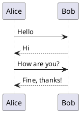
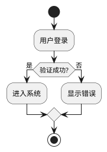
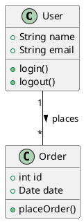

# PlantUML 支持测试

## 1 时序图

```plantuml
@startuml
Alice -> Bob: Hello
Bob --> Alice: Hi
Alice -> Bob: How are you?
Bob --> Alice: Fine, thanks!
@enduml
```

## 2 流程图

```plantuml
@startuml
start
:用户登录;
if (验证成功?) then (是)
  :进入系统;
else (否)
  :显示错误;
endif
stop
@enduml
```

## 3 类图

```plantuml
@startuml
class User {
  +String name
  +String email
  +login()
  +logout()
}

class Order {
  +int id
  +Date date
  +placeOrder()
}

User "1" -- "*" Order : places >
@enduml
```
